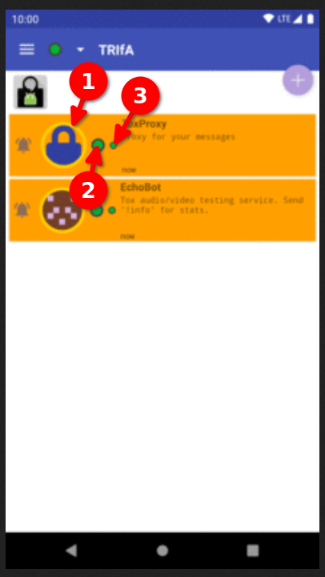

# Overview

Contains [frequently asked questions](https://en.wikipedia.org/wiki/FAQ)
related to Trifa Tox Client.

# List of Content

1. [What are the circles next to a contact?](#what-are-the-circles-next-to-a-contact)

# What are the circles next to a contact?

There are two circles next to a contact, see

* if `1` is
    * green, it means that the contact is **online**
    * red, it means that the contact is **offline**
* if `2` is
    * green, it means that the contact ??
    * red, it means that the contact ??
